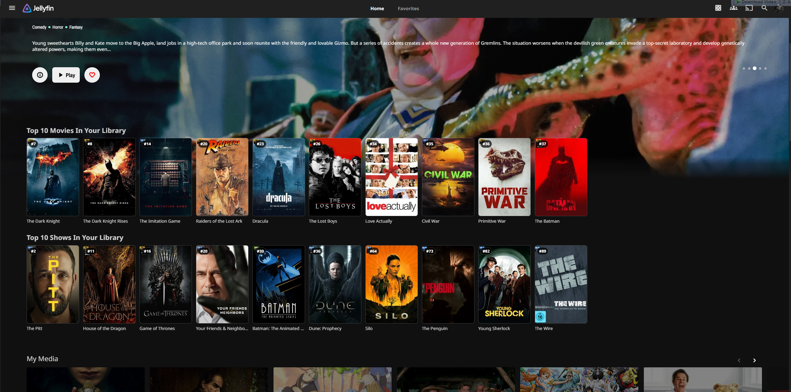

# JellyTrends

JellyTrends adds Netflix-like trending rows to Jellyfin Home and only shows entries that exist in your own library.


## Screenshot



## What It Does

- Adds `Top 10 Movies In Your Library` and `Top 10 Shows In Your Library` sections to the Home page.
- Fetches large trending pools from free public sources (Cinemeta, IMDb suggestion endpoints, Apple RSS backup).
- Prioritizes ID-based matching for better accuracy (`IMDb`, `TMDB`, `TVDB`), then falls back to title/year matching.
- Ranks matches with clear position badges (`#1`, `#2`, ...).
- Caches data to keep Home loading fast after the first render.

## Install (Normal Jellyfin Plugin Flow)

1. Open Jellyfin Dashboard -> `Plugins` -> `Repositories`.
2. Add a new repository:
   - Name: `JellyTrends`
   - URL: `https://raw.githubusercontent.com/marceljhuber/JellyTrends/master/repo/manifest.json`
3. Save, refresh catalog, install `JellyTrends`, then restart Jellyfin.

## Configure

Open Dashboard -> Plugins -> JellyTrends and set:

- Country code (`us`, `de`, `gb`, ...)
- Feed limits for movies/shows
- Top item count to display
- Cache duration
- Strict year matching

## Dependencies

- Requires `File Transformation` plugin for automatic web injection.
- If File Transformation is missing, backend endpoints still work but Home rows will not auto-inject.

## For Maintainers

Build:

```powershell
dotnet build JellyTrends.sln -c Release
```

Create/refresh release zip + manifest:

```powershell
./scripts/New-Release.ps1 -Version 0.1.7.1 -JellyfinVersion 10.11.7 -Owner marceljhuber -Repository JellyTrends -UseRawRepoZip $true
```

The script updates:

- `dist/Release-<jellyfin-version>.zip`
- `repo/manifest.json`
