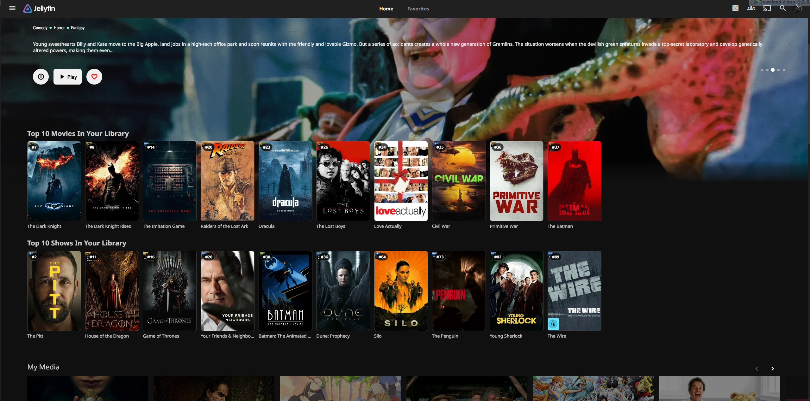

# JellyTrends

JellyTrends adds Netflix-style trending rows to the Jellyfin home screen, showing only the
titles you actually own — and keeping each title's real position in the online chart.


## Screenshot



If *Dune: Prophecy* sits at #36 worldwide and it is the sixth title you own from that chart,
the badge still reads `#36`. That is the point of the rows: they tell you where a title
ranks online, not where it ranks inside your shelf.

## What It Does

- Adds **Top N Movies In Your Library** and **Top N Shows In Your Library** rows to Home.
- Pulls trending charts from TMDB, Trakt, or the keyless Cinemeta catalog.
- Matches charts to your library by IMDb / TMDB / TVDB id first, then by title and year.
- Keeps the online chart position on the rank badge (toggleable).
- Row size is configurable — 10 is the default, anything from 1 to 50 works.
- Renders with Jellyfin's own card and section styles, so the rows sit alongside
  Continue Watching and More Like This without looking bolted on.

## How It Performs

Matching runs on the server. Jellyfin does not expose provider-id filtering through the HTTP
item API, so a client that matched charts itself would have to download the entire library
and index it locally — on every home load. Instead the plugin reads the library in process
and the browser receives only the handful of rows it draws.

One request (`GET /JellyTrends/rows`) returns both the rows and the display settings, so a
render costs a single round trip. Charts, matched rows and the injected assets are all
cached, and the assets revalidate with an ETag.

The DOM observer that re-attaches the rows watches `#homeTab` only, never `document.body`.
That matters most alongside Media Bar, whose slideshow lives on `document.body` and mutates
continuously as slides transition and artwork loads.

## Requirements

- Jellyfin **10.11.0 or newer** (built and tested against 10.11.11).
- The [File Transformation](https://github.com/IAmParadox27/jellyfin-plugin-file-transformation)
  plugin, which is what lets JellyTrends inject the rows into the web client.

## Client Support

The rows are injected into `jellyfin-web`, so every client that renders the server's web
bundle gets them:

| Client | Supported | Notes |
| --- | --- | --- |
| Jellyfin Web (browser) | Yes | |
| Jellyfin for Android | Yes | The official app hosts `jellyfin-web` in a WebView |
| Jellyfin for iOS | Yes | Same WebView architecture |
| Jellyfin Media Player (Windows / macOS / Linux) | Yes | Loads the server's web client |
| Jellyfin for Android TV | No | Native UI, cannot be injected into |
| Swiftfin, Findroid, Roku, Kodi | No | Native UIs |

Serving Jellyfin from a sub path (`https://example.com/jellyfin/`) is handled — the injected
bootstrap resolves the server root at runtime.

### Other injection plugins

The rows mount inside `.homeSectionsContainer`, the same container Jellyfin fills with its
own home sections, so they inherit any layout offset a hero or theme plugin applies. This is
what keeps JellyTrends compatible with
[Media Bar](https://github.com/IAmParadox27/jellyfin-plugin-media-bar), which shifts that
container down (`top: 65vh`) to clear its full-bleed slideshow. Rows mounted outside the
container would miss that offset and end up hidden behind the slideshow.

## Install

1. Open Jellyfin Dashboard → `Plugins` → `Repositories`.
2. Add a repository:
   - Name: `JellyTrends`
   - URL: `https://raw.githubusercontent.com/marceljhuber/JellyTrends/master/repo/manifest.json`
3. Install **File Transformation** if you have not already.
4. Refresh the catalog, install `JellyTrends`, then restart Jellyfin.

A restart is required after enabling the rows: the injection is registered by a startup task.

## Trending Sources

JellyTrends tries sources in order and uses the first one that returns data, so a fresh
install works with no signup at all.

| Source | Credential | What it ranks |
| --- | --- | --- |
| **TMDB** | Free API key | Genuine "trending this week" (or today) |
| **Trakt** | Free Client ID | How many people are watching right now |
| **Cinemeta** | None | General popularity — the keyless default |

- **TMDB key:** themoviedb.org → Settings → API. Both the v3 API key and the v4 "API Read
  Access Token" are accepted; JellyTrends detects which one you pasted.
- **Trakt Client ID:** trakt.tv/oauth/applications → create an app, copy the Client ID.

With `Automatic` selected, TMDB is preferred, then Trakt, then Cinemeta. If a key is wrong or
a source is down, JellyTrends falls through to the next one rather than showing nothing. Use
the **Test source** button on the settings page to see which source answered and what it
returned.

Cinemeta is a real chart with full IMDb and TMDB id coverage, but it ranks by overall
popularity, so classics surface alongside new releases. Add a TMDB key if you want the rows
to track what is actually trending this week.

## Settings

Dashboard → Plugins → JellyTrends.

| Setting | Default | What it does |
| --- | --- | --- |
| Enable plugin | on | Master switch |
| Show trending rows on Home | on | Turns the web injection on or off |
| Source | Automatic | Which chart provider to use |
| TMDB API key | empty | Unlocks TMDB trending |
| Trakt Client ID | empty | Unlocks Trakt trending |
| Trending window | This week | `week` or `day`, TMDB only |
| Titles per row | 10 | 1–50; the row headings follow this number |
| Show the online chart position | on | Off renumbers the badges 1..N |
| Card size scale | 100% | Card width |
| Text size scale | 100% | Heading and label size |
| Movie / Show chart depth | 100 | How far down the chart to look for titles you own |
| Strict year match | off | Title fallback also requires a matching year |
| Cache duration | 180 min | How long charts are reused |

If a row comes up short on a small library, raise the chart depth — the plugin can only show
titles you actually have.

## Troubleshooting

Start with **Test source** in the settings page. It separates backend problems from client
problems in one click:

- It reports a source and a title count → the server side is fine, the problem is in the
  client. Continue below.
- It fails or reports `unavailable` → the server cannot reach any chart provider. Check
  outbound network access and, if you set one, your API key.

### Rows do not appear at all

1. Confirm **File Transformation** is installed and matches your Jellyfin version. It ships
   one release per Jellyfin version.
2. Confirm both *Enable plugin* and *Show trending rows on Home* are on.
3. **Restart Jellyfin.** The injection is registered by a startup task, so a config change
   alone is not enough.
4. **Hard-refresh the client** (Ctrl+Shift+R). The injected `index.html` is cached by
   browsers and by the Android/iOS WebViews.

### Rows are empty, or there is blank space where they should be

Blank space usually means the rows rendered somewhere they are not visible, which happens
when they mount outside `.homeSectionsContainer`. That was a bug in 0.2.0.0 alongside
Media Bar — **update to 0.2.0.1 or newer**.

Empty rows usually mean nothing in the chart matched your library. TMDB's weekly trending
chart is almost entirely brand-new releases, so an older library can legitimately match none
of the top 100. Either raise **Movie/Show chart depth** to 300–500, or switch **Source** to
`Cinemeta`, which mixes in catalogue titles.

### Diagnosing from the browser console

On the Home page, press F12 and run:

```js
(async () => {
  const c = window.ApiClient;
  const rows  = await c.getJSON(c.getUrl('JellyTrends/rows'));
  const chart = await c.getJSON(c.getUrl('JellyTrends/trending'));
  console.log({
    scriptLoaded: !!window.JellyTrendsInit,
    rootInDom:    !!document.getElementById('jellytrends-root'),
    mountTarget:  !!document.querySelector('#homeTab .homeSectionsContainer'),
    enabled: rows.Enabled,
    source:  rows.Source,
    chartSize:   {movies: (chart.Movies||[]).length, shows: (chart.Shows||[]).length},
    matchedRows: {movies: (rows.Movies||[]).length,  shows: (rows.Shows||[]).length},
    sample: (rows.Movies||[]).slice(0,5).map(m => '#' + m.Rank + ' ' + m.Name)
  });
})();
```

| Result | Meaning |
| --- | --- |
| `scriptLoaded: false` | File Transformation is not injecting — see the steps above |
| `mountTarget: false` | Home sections have not rendered yet, or you are on the Favorites tab |
| `chartSize` is `0` | The source is unreachable — check network access and any API key |
| `matchedRows` are `0` | The chart genuinely contains nothing you own — raise chart depth or switch source |
| `matchedRows` > 0 but `rootInDom: false` | A genuine bug; please open an issue with this output |

## Endpoints

| Endpoint | Purpose |
| --- | --- |
| `GET /JellyTrends/rows` | Matched rows plus display settings, in one response |
| `GET /JellyTrends/trending` | Raw charts before library matching, for diagnostics |
| `POST /JellyTrends/test` | Refetches and reports which source answered |
| `GET /JellyTrends/assets/{file}` | Serves the injected JS and CSS, with ETag revalidation |

## For Maintainers

Build (Jellyfin 10.11 targets `net9.0`, so a .NET 9 SDK is required):

```powershell
dotnet build JellyTrends.sln -c Release
```

Create the release zip and refresh the manifest:

```powershell
./scripts/New-Release.ps1 -Version 0.2.0.1 -JellyfinVersion 10.11.11 -Owner marceljhuber -Repository JellyTrends -UseRawRepoZip $true
```

The script writes `dist/Release-<jellyfin-version>.zip` and `repo/manifest.json`. `targetAbi`
is pinned to the start of the minor line (`10.11.0.0`) so the plugin installs on every patch
release of it.

Then commit and push. `dist/` is in `.gitignore`, but the manifest's `sourceUrl` points at
the zip on `raw.githubusercontent.com`, so the zip **must** be force-added or the plugin will
appear in the catalogue and fail to download:

```powershell
git add -A
git add -f dist/Release-10.11.11.zip
git commit -m "Release 0.2.0.1"
git push origin master
```

Verify the published artifacts afterwards — the manifest `checksum` must match the MD5 of the
zip that GitHub is actually serving:

```powershell
(Invoke-RestMethod "https://raw.githubusercontent.com/marceljhuber/JellyTrends/master/repo/manifest.json")[0].versions[0].checksum
Invoke-WebRequest "https://raw.githubusercontent.com/marceljhuber/JellyTrends/master/dist/Release-10.11.11.zip" -OutFile "$env:TEMP\jt.zip"
(Get-FileHash "$env:TEMP\jt.zip" -Algorithm MD5).Hash
```

Keep `build.yaml` in step with the released version — it carries the same metadata for the
Jellyfin plugin build tooling.
