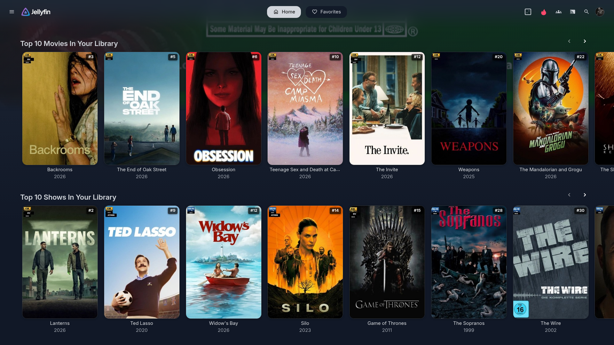
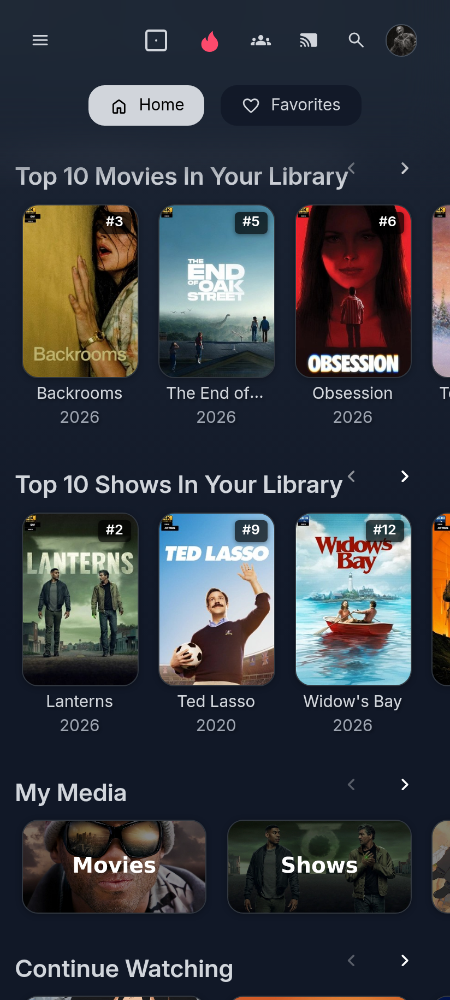
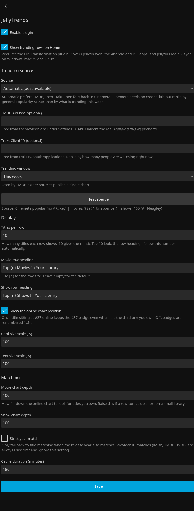

# JellyTrends

JellyTrends adds Netflix-style trending rows to the Jellyfin home screen, showing only the
titles you actually own — and keeping each title's real position in the online chart.


## Screenshots

The rows sit in the home screen like Jellyfin's own sections: same cards, same inset, same
arrow buttons. The `#N` badge (top right) is the title's position in the online chart.



<table>
  <tr>
    <td width="34%"></td>
    <td width="66%"></td>
  </tr>
  <tr>
    <td align="center"><sub>On a phone</sub></td>
    <td align="center"><sub>Dashboard → Plugins → JellyTrends</sub></td>
  </tr>
</table>

If *Dune: Prophecy* sits at #36 worldwide and it is the sixth title you own from that chart,
the badge still reads `#36`. That is the point of the rows: they tell you where a title
ranks online, not where it ranks inside your shelf.

## What It Does

- Adds **Top N Movies In Your Library** and **Top N Shows In Your Library** rows to Home.
- Pulls trending charts from TMDB, Trakt, or the keyless Cinemeta catalog.
- Matches charts to your library by IMDb / TMDB / TVDB id first, then by title and year.
- Keeps the online chart position on the rank badge (toggleable).
- Row size is configurable — 10 is the default, anything from 1 to 50 works.
- Renders with Jellyfin's own section, scroller and card markup, so the rows sit alongside
  Continue Watching and Next Up like a built-in feature: same cards, same arrows, same inset, and
  Jellyfin's own scroller for mouse, touch and remote/gamepad focus. (Native cards show a play
  button on hover; these open the details page instead.)
- Row headings are editable (`{n}` stands for the row size).

## How It Performs

- **Matching runs on the server.** Jellyfin does not expose provider-id filtering through the
  HTTP item API, so a client that matched charts itself would have to download the whole
  library on every home load. The plugin reads the library in process and the browser only
  receives the handful of rows it draws.
- **One request per render** (`GET /JellyTrends/rows`) returns rows and display settings
  together. Matched rows are cached per user and cleared the moment a title is added to or
  removed from the library.
- **Charts never block the home screen.** Once a chart has been fetched it is always served
  instantly; when it expires it is refreshed in the background (stale-while-revalidate).
  Provider pages are fetched concurrently, transient failures are retried once, and a
  provider outage backs off for two minutes instead of hanging every home load.
- **Instant repaints.** The browser keeps the last rows in memory, draws them immediately and
  only repaints if the refreshed answer differs, so the DOM under your cursor is never
  swapped out from under a click. Posters carry Jellyfin's image tag, so they are cached
  exactly like native cards, and lazy-load as you scroll.
- **Cheap observation.** The re-attach observer watches `#homeTab` only and does nothing
  unless the rows have actually gone missing. That matters alongside Media Bar, whose
  slideshow mutates the page continuously.
- **No stale scripts.** Asset URLs carry the plugin version, so an update takes effect
  immediately in browsers and in the Android/iOS WebViews.

## Requirements

- Jellyfin **10.10** or **10.11** (the catalogue serves the right build for your server
  automatically). Builds for each line are compiled against that line's own Jellyfin packages.
- The [File Transformation](https://github.com/IAmParadox27/jellyfin-plugin-file-transformation)
  plugin, which is what lets JellyTrends inject the rows into the web client.

## Client Support

The rows are injected into `jellyfin-web`, so every client that renders the server's web
bundle gets them:

| Client | Supported | Notes |
| --- | --- | --- |
| Jellyfin Web (browser) | Yes | |
| Jellyfin for Android | Yes | The official app hosts `jellyfin-web` in a WebView |
| Jellyfin for iOS | Yes | Same WebView architecture |
| Jellyfin Media Player (Windows / macOS / Linux) | Yes | Loads the server's web client |
| Jellyfin for Android TV | No | Native UI, cannot be injected into |
| Swiftfin, Findroid, Roku, Kodi | No | Native UIs |

Serving Jellyfin from a sub path (`https://example.com/jellyfin/`) is handled — the injected
bootstrap resolves the server root at runtime.

### Other injection plugins

The rows mount inside `.homeSectionsContainer`, the same container Jellyfin fills with its
own home sections, so they inherit any layout offset a hero or theme plugin applies. This is
what keeps JellyTrends compatible with
[Media Bar](https://github.com/IAmParadox27/jellyfin-plugin-media-bar), which shifts that
container down (`top: 65vh`) to clear its full-bleed slideshow. Rows mounted outside the
container would miss that offset and end up hidden behind the slideshow.

## Install

1. Open Jellyfin Dashboard → `Plugins` → `Repositories`.
2. Add a repository:
   - Name: `JellyTrends`
   - URL: `https://raw.githubusercontent.com/marceljhuber/JellyTrends/master/repo/manifest.json`
3. Install **File Transformation** if you have not already.
4. Refresh the catalog, install `JellyTrends`, then restart Jellyfin.

The injection is registered at startup and checks your settings on every page load, so
toggling the rows on or off needs no restart. Hard-refresh the client once after installing.

## Trending Sources

JellyTrends tries sources in order and uses the first one that returns data, so a fresh
install works with no signup at all.

| Source | Credential | What it ranks |
| --- | --- | --- |
| **TMDB** | Free API key | Genuine "trending this week" (or today) |
| **Trakt** | Free Client ID | How many people are watching right now |
| **Cinemeta** | None | General popularity — the keyless default |

- **TMDB key:** themoviedb.org → Settings → API. Both the v3 API key and the v4 "API Read
  Access Token" are accepted; JellyTrends detects which one you pasted.
- **Trakt Client ID:** trakt.tv/oauth/applications → create an app, copy the Client ID.

With `Automatic` selected, TMDB is preferred, then Trakt, then Cinemeta. If a key is wrong or
a source is down, JellyTrends falls through to the next one rather than showing nothing. Use
the **Test source** button on the settings page to see which source answered and what it
returned.

Cinemeta is a real chart with full IMDb and TMDB id coverage, but it ranks by overall
popularity, so classics surface alongside new releases. Add a TMDB key if you want the rows
to track what is actually trending this week.

## Settings

Dashboard → Plugins → JellyTrends.

| Setting | Default | What it does |
| --- | --- | --- |
| Enable plugin | on | Master switch |
| Show trending rows on Home | on | Turns the web injection on or off |
| Movie / Show row heading | `Top {n} … In Your Library` | `{n}` becomes the row size |
| Source | Automatic | Which chart provider to use |
| TMDB API key | empty | Unlocks TMDB trending |
| Trakt Client ID | empty | Unlocks Trakt trending |
| Trending window | This week | `week` or `day`, TMDB only |
| Titles per row | 10 | 1–50; the row headings follow this number |
| Show the online chart position | on | Off renumbers the badges 1..N |
| Card size scale | 100% | Card width |
| Text size scale | 100% | Heading and label size |
| Movie / Show chart depth | 100 | How far down the chart to look for titles you own |
| Strict year match | off | Title fallback also requires a matching year |
| Cache duration | 180 min | How long charts are reused |

If a row comes up short on a small library, raise the chart depth — the plugin can only show
titles you actually have.

## Troubleshooting

Start with **Test source** in the settings page. It separates backend problems from client
problems in one click:

- It reports a source and a title count → the server side is fine, the problem is in the
  client. Continue below.
- It fails or reports `unavailable` → the server cannot reach any chart provider. Check
  outbound network access and, if you set one, your API key.

### Rows do not appear at all

1. Confirm **File Transformation** is installed and matches your Jellyfin version. It ships
   one release per Jellyfin version.
2. Confirm both *Enable plugin* and *Show trending rows on Home* are on.
3. **Restart Jellyfin** after installing JellyTrends or File Transformation, so the startup
   task can register the injection.
4. **Hard-refresh the client** (Ctrl+Shift+R). The injected `index.html` is cached by
   browsers and by the Android/iOS WebViews.

### The login page or a details page is blank (0.3.0 only)

0.3.0 broke lazily loaded pages of the web client. **Update to 0.3.1 or newer**, then
hard-refresh.

### Rows are empty

Empty rows usually mean nothing in the chart matched your library. TMDB's weekly trending
chart is almost entirely brand-new releases, so an older library can legitimately match none
of the top 100. Either raise **Movie/Show chart depth** to 300–500, or switch **Source** to
`Cinemeta`, which mixes in catalogue titles.

### Diagnosing from the browser console

On the Home page, press F12 and run:

```js
(async () => {
  const c = window.ApiClient;
  const rows  = await c.getJSON(c.getUrl('JellyTrends/rows'));
  const chart = await c.getJSON(c.getUrl('JellyTrends/trending'));
  console.log({
    scriptLoaded: !!window.JellyTrendsInit,
    rootInDom:    !!document.getElementById('jellytrends-root'),
    mountTarget:  !!document.querySelector('#homeTab .homeSectionsContainer'),
    nativeScroller: !!document.querySelector('#jellytrends-root [is="emby-scroller"]'),
    enabled: rows.Enabled,
    source:  rows.Source,
    chartSize:   {movies: (chart.Movies||[]).length, shows: (chart.Shows||[]).length},
    matchedRows: {movies: (rows.Movies||[]).length,  shows: (rows.Shows||[]).length},
    sample: (rows.Movies||[]).slice(0,5).map(m => '#' + m.Rank + ' ' + m.Name)
  });
})();
```

| Result | Meaning |
| --- | --- |
| `scriptLoaded: false` | File Transformation is not injecting — see the steps above |
| `mountTarget: false` | Home sections have not rendered yet, or you are on the Favorites tab |
| `chartSize` is `0` | The source is unreachable — check network access and any API key |
| `matchedRows` are `0` | The chart genuinely contains nothing you own — raise chart depth or switch source |
| `matchedRows` > 0 but `rootInDom: false` | A genuine bug; please open an issue with this output |

## Endpoints

| Endpoint | Auth | Purpose |
| --- | --- | --- |
| `GET /JellyTrends/rows` | signed-in user | Matched rows plus display settings, scoped to the caller's library |
| `GET /JellyTrends/trending` | signed-in user | Raw charts before library matching, for diagnostics |
| `POST /JellyTrends/test` | administrator | Refetches and reports which source answered |
| `GET /JellyTrends/assets/{file}` | none | Serves the injected JS and CSS, with ETag revalidation |

## For Maintainers

Each Jellyfin line needs its own binary, so the project builds against one Jellyfin version
at a time:

```sh
dotnet build JellyTrends.sln -c Release                              # 10.11 (net9.0), the default
dotnet build JellyTrends.sln -c Release -p:JellyfinVersion=10.10.7   # 10.10 (net8.0)
dotnet build JellyTrends.sln -c Release -p:JellyfinVersion=12.0.0    # 12.x (net10.0), compile-checked only
```

Cut a release (builds every target, writes `dist/*.zip` and `repo/manifest.json`):

```sh
python scripts/release.py --version 0.3.0 --changelog "What changed"
```

Versions are `<version>.<n>` where `n` is 0 for 10.10 and 1 for 10.11, so a 10.11 server —
which can install either entry — always picks its own build. Then commit, force-adding the
zips because `dist/` is git-ignored but the manifest points at it:

```sh
git add -A && git add -f dist/*.zip
git commit -m "Release 0.3.0" && git push origin master
```

Afterwards confirm each manifest `checksum` equals the MD5 of the zip GitHub actually serves.
Keep `build.yaml` in step with the released version.

## License

GPL-3.0, as required for plugins compiled against Jellyfin's packages. See [LICENSE](LICENSE).
